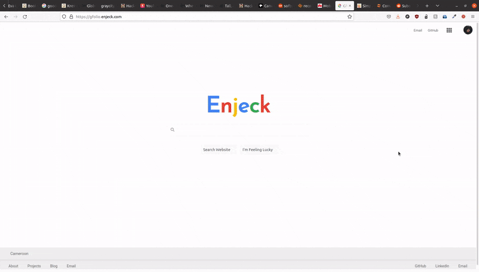

## gfolio | Google Search inspired portfolio website

This is a personal website simulating Google Search. Built with NextJS.

See mine online: https://gfolio.enjeck.com/

<kbd>

 </kbd>

 ### Usage

 To run the code locally, follow these steps:
```
git clone https://github.com/enjeck/gfolio.git
cd gfolio
npm install
npm run dev
```

The app will be available at http://localhost:3000

To use this template for your own portfolio, follow the steps in the [QUICKSTART.md](QUICKSTART.md) file.
```

### Architecture

See [ARCHITECTURE.md](ARCHITECTURE.md) for a detailed explanation and drawings of the architecture.

### License

[GPL-3.0](LICENSE) Copyright (c) 2021 Enjeck

